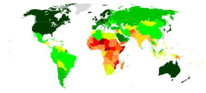

# pipelines-project

## Analizando multiples datos de paises:

### La idea principal es que de este proyecto poder sacar muchisimos datos diferentes para todo tipos de datos interesantes en el futuro

#### Podemos sacar por ejemplo datos del PIB por paises; por ejmeplo: 

#### Por otra partede combinamos la información nativa de la base datos, con datos incorporados de una API, para que el usuario introduzca el país del que quiera obtener información. El progrma le ofrecera una serie de datos variados